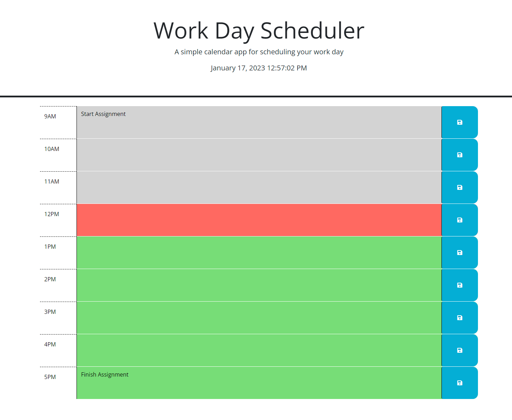

# Homework Week 5
## Time-Schedule-Calender

### User Story
```
AS AN employee with a busy schedule
I WANT to add important events to a daily planner
SO THAT I can manage my time effectively
```

### Acceptance Criteria
```
GIVEN I am using a daily planner to create a schedule
WHEN I open the planner
THEN the current day is displayed at the top of the calendar
WHEN I scroll down
THEN I am presented with timeblocks for standard business hours
WHEN I view the timeblocks for that day
THEN each timeblock is color coded to indicate whether it is in the past, present, or future
WHEN I click into a timeblock
THEN I can enter an event
WHEN I click the save button for that timeblock
THEN the text for that event is saved in local storage
WHEN I refresh the page
THEN the saved events persist
```
### Work Description
I first started by adding the clock to the header element using the Day.JS functionality. Once the clock was functioning I was able to set up the JS code necessary to change the colour of the input boxes to match the hour of the day and present with past, present and future by adding a class value to the HTML.

I then added functionality to the save button to respond and log the inputted text in the textarea in the parent id of that particular save button. Then I added the function for the page to read already present data found in localstorage and load it onto the page in the correct input box.

I had a few minor issues when writing the code which forced me to look at other options in jQuery that I could use to achieve the desired result with less code.

>## [**Link to live GitPage**](https://lucienpep.github.io/Time-Schedule-Calender/)



---
Lucien Haines UADL 2023